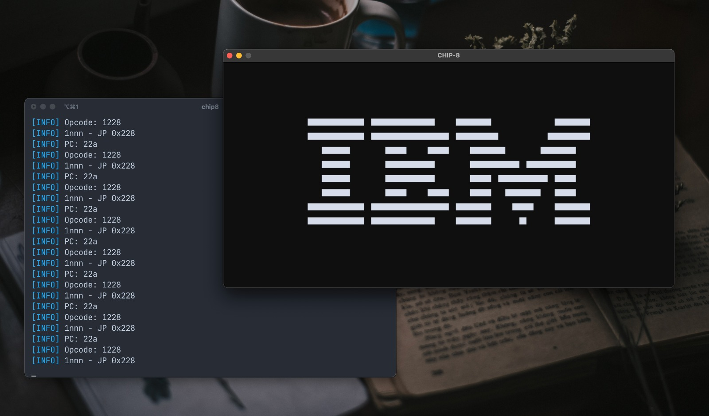

# 👾 CHIP-8 Emulator



CHIP-8 is an interpreted programming language, developed by Joseph Weisbecker on his 1802 microprocessor ([Wikepedia](https://en.wikipedia.org/wiki/CHIP-8)). This project is a CHIP-8 emulator written in C. I wrote it with the goal of dipping my feet into C while building something fun.\
Fantastic references:

- [Cowgod's Reference](http://devernay.free.fr/hacks/chip8/C8TECH10.HTM)
- [Tobias's Guide](https://tobiasvl.github.io/blog/write-a-chip-8-emulator/)

## Features

- Full CHIP-8 instruction set emulation
- Scalable display window
- Adjustable CPU cycle speed for game compatibility
- Sound support for the CHIP-8 buzzer
- Customizable background and foreground colors via hex codes

## Building

0. Make sure you have the following installed on your system

- A C compiler (like [GCC](https://gcc.gnu.org/) or [Clang](https://clang.llvm.org/) etc.)
- [CMake](https://cmake.org/)

1. Clone the repository

```sh
git clone https://github.com/caffeinated01/chip-8.git
cd chip-8
```

2. Create a build directory and run CMake

```sh
mkdir build
cd build
cmake ..
```

3. Compile (and hope it works)

```sh
make
```

This will create a `chip8` executable in `build/bin/`

## Running

`Usage: chip8 [-v] [-s <scale>] [-d <delay>] [-c <bg_color> <fg_color>] -r <rom_path>` \
`-v` is for verbose logging. Ommit this to disable verbose logging. NOTE: only enable this if you are debugging or want to see what's going on behind the scenes, the sheer amount of IO slows down the emulator significantly. \
`-s` is for scale. Scale is multiplied to original display height and width, 64 and 32. A scale of 10 would result in a window that is 640px by 320px large. Defaulted as 10. \
`-d` is for cycle delay. Defaulted as 1. \
`-c` is for the colors rendered on screen. Pass in 2 hex color codes -- the first for background and second for foreground.
`-r` is for path to rom. \
Example usage:

```sh
./chip8 -r roms/ibm-logo.ch8 -s 15 -d 3 -c #0e0f0e #d6dce9
```

## Contributions

Contributions are welcome!

### Bugs / Suggestions

If you find a bug or have suggestions for new features open a [new issue](https://github.com/caffeinated01/chip-8/issues)

### Pull Requests

1. Fork the repository
2. Push changes to your fork
3. Open a pull request to the `main` branch
